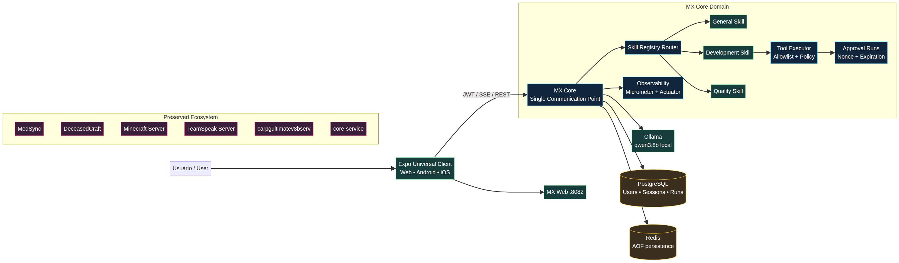

# MX — Local Universe of Intelligence, Care and Productivity

**Technical documentation and professional portfolio — English**  
**Author:** Macedo Sousa  
**Project:** `MacedoSousa/MX-IA-Assist`  
**Evidence date:** August 20, 2026  
**License and access:** private repository, executed locally on Windows

> MX is a local personal assistant inspired by the “Jarvis” concept. Its architectural principle is that the user communicates with one intelligent core. MX Core interprets intent, selects an expert skill, applies security policies, coordinates authorized tools and returns the result through the central channel.

## 1. Executive summary

MX was created to address a practical problem in development and personal productivity: too many tools, agents, interfaces and knowledge sources without a central layer for decision-making, security and observability. Instead of exposing multiple agents directly to the user, the project establishes **MX Core as the single communication point**. Skills are internal specialists governed by explicit contracts and replaceable implementations.

The solution combines **Java 21, Spring Boot 4, Clean Architecture, TDD, SOLID, PostgreSQL, Redis, Ollama, Expo Web/React Native and Docker Compose**. The currently validated local model is `qwen3:8b`. Language-model execution remains on the user's computer, reducing external-service dependency and allowing MX to support technical subjects, software quality, development and general conversation.

The project can be presented as a small operational universe:

| Dimension | MX implementation | Demonstrated value |
|---|---|---|
| Intelligence | MX Core, Ollama and specialist skills | Centralized interpretation and multi-domain execution |
| Care | Security, human approval, revocable sessions and sandboxing | Sensitive operations are not executed silently |
| Productivity | Universal client, internal tools, SSE streaming and Docker automation | One interaction point for technical work |
| Reliability | TDD, healthchecks, Micrometer metrics and runbook | Verifiable, operable and documented software |
| Responsible autonomy | Autonomy levels and PolicyEngine | Read-only automation; sensitive actions await approval |

## 2. Problem and vision

The original problem was not simply to build a chatbot. The goal was to create a personal intelligence layer able to support programming, studies, personal topics and operational tasks while preserving privacy and human control over risky actions. MX's vision is to evolve from a collection of tools into an **integrated system of intelligence, care and productivity**.

Making MX Core the single communication point avoids allowing every agent to create its own API, authentication model or security policy. Specialization happens internally: GeneralSkill handles broad conversation, DevelopmentSkill supports development and structured tools, and QualitySkill incorporates the user's Software Quality coursework through a versioned knowledge base.

## 3. Architecture



The architecture explicitly separates domain rules, application use cases and infrastructure adapters. The Expo client does not contain business rules; it authenticates, sends messages, receives streaming events and synchronizes approvals. MX Core coordinates the execution lifecycle and delegates specialization to the appropriate skill. The backend communicates with PostgreSQL, Redis and Ollama through ports and adapters, while model output is never treated as an authorization authority.

| Layer | Responsibility | Project examples |
|---|---|---|
| Interface | Transport commands and events | REST controllers, SSE and Expo Web/Mobile |
| Application | Orchestrate use cases | `MxCoreService`, `SendMessageUseCase`, runs and approval |
| Domain | Stable rules and contracts | Skills, autonomy, PolicyEngine, tools and ExecutionRun |
| Infrastructure | Implement integrations | JPA/PostgreSQL, Redis, Ollama HTTP and metrics |
| Operations | Run, observe and recover | Compose, healthchecks, launcher and Always-On task |

### 3.1 Main execution flow

1. The user sends a message through the universal client.
2. The authenticated endpoint creates or retrieves the conversation and forwards the request to MX Core.
3. The router selects an expert skill according to intent and contract.
4. The skill calls the local model gateway and, when necessary, produces a structured tool call.
5. `ToolCallParser` accepts only the explicit `[MX_TOOL_CALL]` marker with valid JSON.
6. `ToolRegistry` and `PolicyEngine` validate the name, arguments, allowlist and autonomy.
7. Authorized read-only tools may execute automatically; sensitive operations create `AWAITING_APPROVAL` with a hashed nonce, expiration and idempotency.
8. The answer returns through the single REST or SSE channel without exposing infrastructure secrets.

### 3.2 Expert skills

| Skill | Role | Knowledge and autonomy |
|---|---|---|
| GeneralSkill | General conversation and routing | Handles broad topics, detects domains and rejects prompt-injection instructions |
| DevelopmentSkill | Development assistance | Interprets structured calls and executes permitted tools, prioritizing read-only actions |
| QualitySkill | Software Quality | ISO/IEC 25010, CMMI, metrics, testing, requirements and versioned EAD knowledge |

QualitySkill is not irreversible fine-tuning. It uses the controlled knowledge base in `docs/knowledge/qualidade-software.md`, which can be reviewed, tested and versioned without rebuilding the model. This approach improves traceability and reduces operational cost.

## 4. Security by default

The project does not delegate security to generated text. A model may suggest a call, but execution depends on deterministic code-level validation.

| Control | Project evidence |
|---|---|
| JWT and rotating refresh | Persisted sessions, revocable refresh and invalidating logout |
| Human approval | `AWAITING_APPROVAL`, SHA-256 nonce, expiration and idempotency |
| Tool allowlist | `ToolRegistry`, `ToolDefinition` and `PolicyEngine` |
| Workspace sandbox | Byte limit, symlink blocking and directory scoping |
| Prompt-injection protection | Adversarial tests in GeneralSkill and ToolExecutor |
| Secrets outside evidence | E2E scripts do not persist tokens, passwords or sensitive payloads |
| Single channel | Skills are internal and do not expose independent user-facing APIs |

When a sensitive operation requires authorization, MX does not treat a text response as confirmation. The use case creates a persisted run and returns the minimum metadata required for the client to synchronize and approve it. Post-approval continuation remains a separate evolution point, allowing idempotent re-execution to be added without weakening the existing control boundary.

## 5. Organized Docker stack

The primary environment uses stable names, documented ports, healthchecks and persistent data. Compose uses volumes or bind mounts so recreating containers does not delete PostgreSQL, Redis, Ollama or Open WebUI state. Docker documents volumes as persistent stores independent of a container's lifecycle [1] [2].

| Container | Image | Port | Expected state | Data responsibility |
|---|---|---:|---|---|
| `mx-core` | `mx-core:latest` | 8080 | Healthy | Backend, migrations and API |
| `mx-web` | `mx-web:latest` | 8082 | Up | Expo bundle served by Nginx |
| `mx-postgres` | `postgres:16` | 5432 | Healthy | MX database |
| `mx-redis` | `redis:7` | 6379 | Healthy | Auxiliary cache/session data with AOF |
| `mx-ollama` | `ollama/ollama:latest` | 11434 | Up | Local models, including `qwen3:8b` |
| `mx-open-webui` | `ghcr.io/open-webui/open-webui:main` | 3000 | Healthy | Auxiliary local-model interface |

The `medsync` services, `deceasedCraft`, Minecraft, TeamSpeak, `carpg-server`, `core-service` and the requested Compose artifacts were treated as preserved resources. The cleanup removed only stopped test containers with automatic names, unused images and build cache. **No volume or network was removed.**

### 5.1 Safe-cleanup evidence

The cleanup recorded `Total reclaimed space: 14.56GB`. The post-cleanup inventory recorded 15 images in use, 15 catalogued containers, 19 local volumes and preserved MX, MedSync, Minecraft, TeamSpeak, carpg, deceasedCraft and core-service resources. Full evidence is available under:

- `docs/evidence/docker-inventory/containers-after-cleanup.txt`
- `docs/evidence/docker-inventory/images-after-cleanup.txt`
- `docs/evidence/docker-inventory/volumes-after-cleanup.txt`
- `docs/evidence/docker-inventory/disk-usage-after-cleanup.txt`
- `scripts/cleanup-docker.ps1`

The script defaults to dry-run mode. Cleanup is applied only with `-Apply`, and the policy explicitly does not run `docker volume prune` or `docker network prune`.

## 6. Always-On operation and persistence

On Windows, the `MX-AI-Assistant-AlwaysOn` scheduled task runs the launcher idempotently. The launcher waits for Docker Desktop, starts or reconciles Compose without unnecessary rebuilds and does not stop the other servers. The task was executed successfully with `LastTaskResult = 0` and zero missed runs.

“Always-on” does not mean that physical RAM can never be reclaimed by the operating system. It means MX starts automatically and its **data, models, sessions, conversations and configuration** remain in persistent storage. To avoid logical state loss, Compose uses persistent volumes or bind mounts, Redis AOF and PostgreSQL data outside the ephemeral container lifecycle.

| Mechanism | Purpose |
|---|---|
| `restart: unless-stopped` | Recover containers after failures or daemon restarts |
| Windows Task Scheduler | Start MX after Windows logon/startup |
| Persistent bind mounts | Preserve database, cache, models and configuration |
| Healthchecks | Prevent the web client from starting before Core is healthy |
| Redis AOF | Reduce state loss during restarts |
| Runbook | Provide predictable manual recovery |

Task installation and removal are controlled by `scripts/install-mx-always-on.ps1`. Installation is idempotent and does not modify preserved services.

## 7. Reproducible evidence and executions

### 7.1 Stack healthcheck

The `scripts/verify-mx-stack.ps1` execution returned `Overall result: PASS` on August 20, 2026. The following endpoints returned HTTP 200:

| Probe | Result |
|---|---:|
| `http://localhost:8080/actuator/health` | 200 / PASS |
| `http://localhost:8082/health` | 200 / PASS |
| `http://localhost:11434/api/tags` | 200 / PASS |
| `http://localhost:3000/health` | 200 / PASS |

The report is stored at `docs/evidence/executions/mx-stack-verification.md`, with a corresponding JSON file for automated auditing.

### 7.2 Backend TDD

The full suite executed inside a Maven/JDK container and finished with exit code 0. The summary recorded:

| Metric | Result |
|---|---:|
| Report files | 30 |
| Tests | 79 |
| Failures | 0 |
| Errors | 0 |
| Skipped | 0 |
| Result | PASS |

The raw execution is stored in `docs/evidence/executions/maven-test-run.txt`; the summaries are `tdd-summary.md` and `tdd-summary.json`. The command was:

```powershell
docker run --rm `
  -v D:\MX\core-service:/app `
  -v D:\MX\maven-test-target:/app/target `
  -v C:\Windows\Temp\mx-m2:/root/.m2/repository `
  -w /app `
  maven:3.9-eclipse-temurin-21 mvn test
```

### 7.3 E2E flow

The versioned `scripts/e2e-auth-chat.ps1` registers a disposable user, performs login, confirms a persisted JWT session and sends a message through the central endpoint. The script masks tokens and does not record credentials. The expected result is `chatStatus=COMPLETED`, with the response processed by the local `qwen3:8b` model.

### 7.4 Diagram and visual record

The architecture diagram in `docs/architecture/mx-universe.png` is rendered from `mx-universe.mmd`. It shows the single client, MX Core, skills, tools, persistence and preserved services. The documentation also includes terminal logs, inventories, JSON reports and the E2E execution as traceable evidence.

## 8. How to use the system

On the Windows computer, run:

```powershell
cd D:\MX
.\start.bat
```

The main interface is available at `http://localhost:8082`. From a phone on the same network, use `http://<COMPUTER-LAN-IP>:8082`. The launcher injects the LAN API URL into the web bundle and enables CORS in the development profile. Windows Firewall must allow port 8082 on the private network.

The user talks to MX Core, not directly to GeneralSkill, DevelopmentSkill or QualitySkill. Approvals can be queried through the run synchronization panel, and the normal SSE event set includes `started`, `token`, `completed` and `approval_required`.

## 9. Positioning the project in a job application

MX demonstrates more than an LLM integration. It demonstrates product thinking, clean architecture, agent governance, TDD, operational security and concern for a cross-platform user experience. A concise interview narrative is:

> “I built a local personal assistant with Java 21 and Spring Boot using Clean Architecture, where a central core coordinates specialist skills. It runs on local Ollama, includes JWT authentication with persisted sessions, human approval for sensitive operations, SSE streaming, a universal Expo client and Docker Always-On operation. Quality is part of the product: the system has 79 passing automated tests, metrics, healthchecks, a runbook and reproducible evidence.”

The “universe of intelligence, care and productivity” framing connects three engineering choices. Intelligence means local multi-domain capability; care means security, approval and data preservation; productivity means a single interface, internal tools and operational automation. This narrative connects personal motivation to verifiable engineering decisions.

## 10. Known limitations and next increments

The system is available for local use, but it remains an evolving project. The post-human-approval flow should be extended to re-execute the approved operation idempotently and record the final tool result. Phone access depends on the local network and firewall rules. Always-On depends on Windows and Docker Desktop being available; it is not equivalent to production high availability.

Recommended next increments include scheduled backups with retention, restoration testing on a separate machine, historical observability and validation on physical Android and iOS devices. These are incremental improvements and do not invalidate the currently executable core.

## 11. External references

[1]: https://docs.docker.com/reference/compose-file/services/ "Docker Compose services"

[2]: https://docs.docker.com/reference/compose-file/volumes/ "Docker Compose volumes"

[3]: https://docs.spring.io/spring-boot/reference/actuator/endpoints.html "Spring Boot Actuator endpoints"

[4]: https://docs.ollama.com/api/introduction "Ollama API introduction"

[5]: https://docs.expo.dev/deploy/web/ "Expo web deployment"

## 12. Main artifacts

| Artifact | Purpose |
|---|---|
| `start.bat` | Docker-only local launcher |
| `scripts/install-mx-always-on.ps1` | Always-On task installation |
| `scripts/verify-mx-stack.ps1` | Healthchecks and environment evidence |
| `scripts/cleanup-docker.ps1` | Safe cleanup with dry-run |
| `scripts/e2e-auth-chat.ps1` | Secret-free E2E evidence |
| `scripts/summarize-tdd.ps1` | Surefire report summary |
| `infrastructure/docker/compose/docker-compose.yml` | Service orchestration |
| `docs/architecture/mx-universe.png` | Visual architecture diagram |
| `docs/knowledge/qualidade-software.md` | QualitySkill knowledge base |
| `docs/evidence/` | Inventory and execution evidence |
